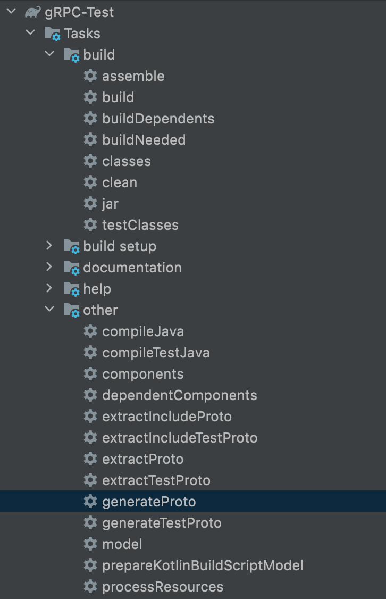
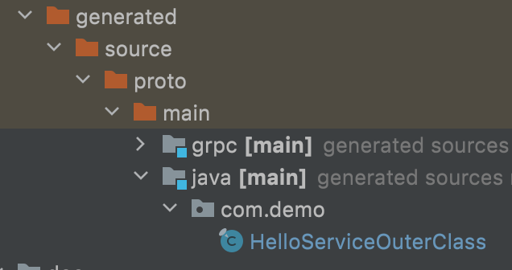
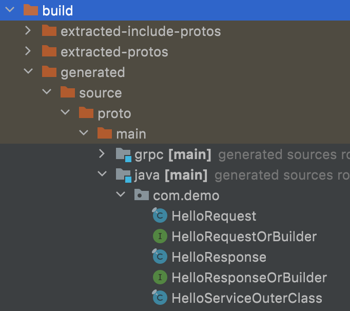

# gRPC

> gRPC는 protocol buffer 또는 Interface Definition Language 로 사용할 수 있다. 


> **protocol buffer**: 프로토콜 버퍼는 구조화된 데이터를 직렬화하는 방식이다. 유선이나 데이터 저장을 목적으로 서로 통신할 프로그램을 개발할 때 유용하다.
>
> **Interface Definition Language**: 인터페이스 정의 언어는 소프트웨어 컴포넌트의 인터페이스를 묘사하기 위한 명세 언어이다. IDL은 어느 한 언어에 국한되지 않는 언어중립적인 방법으로 인터페이스를 표현함으로써, 같은 언어를 사용하지 않는 소프트웨어 컴포넌트 사이의 통신을 가능하게 한다.


### Overview

gRPC는 다른 기기, 다른 server application 사이에서 method를 바로 호출할 수 있게 해주고, application과 service 배포를 쉽게 할 수 있다. 메소드의 파라미터와 리턴타입을 정의해서 원격으로 호출 하게된다. 서버에서는 gRPC 서버를 통해 클라이언트의 call을 핸들링한다. 클라이언트에서는 서버와 같은 메소드가 정의된 stub가 있어야한다.


gRPC Client들은 다양한 환경에서 서버와 통신 할 수 있다. gRPC는 여러 언어들을 지원하는 데 자바로 된 서버에 go, python, ruby등 언어로 클라이언트를 구성할 수 있다. 또한 Google API도 gRPC를 지원해서 구글의 다양한 기능을 사용할 수 있다.


### 세팅방법

> 자바로 세팅된 gradle 프로젝트에 gRPC Server와 gRPC Client 구현


1. 다음과 같이 build.gradle 파일 수정

   build.gradle

   ```groovy
   plugins {
       id 'com.google.protobuf' version '0.8.17' // 추가
       id 'java'
   }
   
   group 'org.example'
   version '1.0-SNAPSHOT'
   
   repositories {
       mavenCentral()
   }
   
   dependencies {
       // ===== 추가 =====
       implementation 'io.grpc:grpc-netty-shaded:1.41.0'
       implementation 'io.grpc:grpc-protobuf:1.41.0'
       implementation 'io.grpc:grpc-stub:1.41.0'
       compileOnly 'org.apache.tomcat:annotations-api:6.0.53'
       // ===============
     
       testImplementation 'org.junit.jupiter:junit-jupiter-api:5.7.0'
       testRuntimeOnly 'org.junit.jupiter:junit-jupiter-engine:5.7.0'
   }
   
   test {
       useJUnitPlatform()
   }
   
   // 추가
   // generageProto 등 유틸제공
   protobuf {
       protoc {
           artifact = "com.google.protobuf:protoc:3.17.3"
       }
       plugins {
           grpc {
               artifact = 'io.grpc:protoc-gen-grpc-java:1.41.0'
           }
       }
       generateProtoTasks {
           all()*.plugins {
               grpc {}
           }
       }
   }
   ```

   

2. HelloService.proto 작성

   ```proto
   // 사용될 문법
   syntax = "proto3";
   // 기본적으로 생성될 자바파일이 하나로 되어있으나 true로 설저하면 하나하나 생성된다.
   option java_multiple_files = true;
   // 생성할 패키지
   package com.demo;
   
   // request message 형태 정의
   message HelloRequest {
     string firstName = 1;
     string lastName = 2;
   }
   
   // response message 형태 정의
   message HelloResponse {
     string greeting = 1;
   }
   
   // rpc method 정의
   service HelloService {
     rpc hello(HelloRequest) returns (HelloResponse);
   }
   ```

   

3. generate Proto를 통해 코드 생성

   

   

   | option java_multiple_files = false                        | option java_multiple_files = true                         |
   | --------------------------------------------------------- | --------------------------------------------------------- |
   |  |  |

   

4. 생성된 HelloServiceGrpc.java를 보면 proto에 정의한 method가 추상클래가 생긴다.

   ```java
   /**
    */
   public static abstract class HelloServiceImplBase implements io.grpc.BindableService {
   
     /**
      */
     public void hello(com.demo.HelloRequest request,
         io.grpc.stub.StreamObserver<com.demo.HelloResponse> responseObserver) {
       io.grpc.stub.ServerCalls.asyncUnimplementedUnaryCall(getHelloMethod(), responseObserver);
     }
   
     @java.lang.Override public final io.grpc.ServerServiceDefinition bindService() {
       return io.grpc.ServerServiceDefinition.builder(getServiceDescriptor())
           .addMethod(
             getHelloMethod(),
             io.grpc.stub.ServerCalls.asyncUnaryCall(
               new MethodHandlers<
                 com.demo.HelloRequest,
                 com.demo.HelloResponse>(
                   this, METHODID_HELLO)))
           .build();
     }
   }
   ```

   

5. 위에 생성된 클래스 구현

   ```java
   public class HelloServiceImpl extends HelloServiceGrpc.HelloServiceImplBase {
       @Override
       public void hello(HelloRequest request, StreamObserver<HelloResponse> responseObserver) {
           String greeting = new StringBuilder()
                   .append("hello, ")
                   .append(request.getFirstName())
                   .append(" ")
                   .append(request.getLastName())
                   .toString();
   
           HelloResponse helloResponse = HelloResponse.newBuilder()
                   .setGreeting(greeting)
                   .build();
   
           responseObserver.onNext(helloResponse);
           responseObserver.onCompleted();
       }
   }
   ```


6. 위에 구현한 service를 서버에 등록한다.

   ```java
   public class HelloServiceImpl extends HelloServiceGrpc.HelloServiceImplBase {
       @Override
       public void hello(HelloRequest request, StreamObserver<HelloResponse> responseObserver) {
           String greeting = new StringBuilder()
                   .append("hello, ")
                   .append(request.getFirstName())
                   .append(" ")
                   .append(request.getLastName())
                   .toString();
   
           HelloResponse helloResponse = HelloResponse.newBuilder()
                   .setGreeting(greeting)
                   .build();
   
           responseObserver.onNext(helloResponse);
           responseObserver.onCompleted();
       }
   }
   ```


7. Client 구현

   ```java
   public class GRPCClient {
       private static HelloServiceGrpc.HelloServiceBlockingStub blockingStub;
   
       public static void main(String[] args) {
           ManagedChannel channel = ManagedChannelBuilder.forTarget("localhost:8800").usePlaintext().build();
   
           blockingStub = HelloServiceGrpc.newBlockingStub(channel);
   
           HelloRequest request = HelloRequest.newBuilder()
                   .setFirstName("firstnameEx")
                   .setLastName("lastNameEx")
                   .build();
   
           HelloResponse response;
           try {
               response = blockingStub.hello(request);
           } catch (StatusRuntimeException e) {
               return;
           }
           System.out.println("Greeting: " + response.getGreeting());
       }
   }
   ```


8. 테스트 결과

   1. 서버

      ```
      11:42:40 오전: Executing task ':GRPCServer.main()'...
      
      > Task :extractIncludeProto UP-TO-DATE
      > Task :extractProto UP-TO-DATE
      > Task :generateProto UP-TO-DATE
      > Task :compileJava
      > Task :processResources UP-TO-DATE
      > Task :classes
      
      > Task :GRPCServer.main()
      server staring...
      ```

   2. 클라이언트

      ```
      3:59:44 오후: Executing task ':GRPCClient.main()'...
      
      > Task :extractIncludeProto UP-TO-DATE
      > Task :extractProto UP-TO-DATE
      > Task :generateProto UP-TO-DATE
      > Task :compileJava
      > Task :processResources
      > Task :classes
      
      > Task :GRPCClient.main()
      Greeting: hello, firstnameEx lastNameEx
      
      Deprecated Gradle features were used in this build, making it incompatible with Gradle 8.0.
      
      You can use '--warning-mode all' to show the individual deprecation warnings and determine if they come from your own scripts or plugins.
      
      See https://docs.gradle.org/7.1/userguide/command_line_interface.html#sec:command_line_warnings
      
      BUILD SUCCESSFUL in 4s
      6 actionable tasks: 3 executed, 3 up-to-date
      3:59:49 오후: Task execution finished ':GRPCClient.main()'.
      ```

